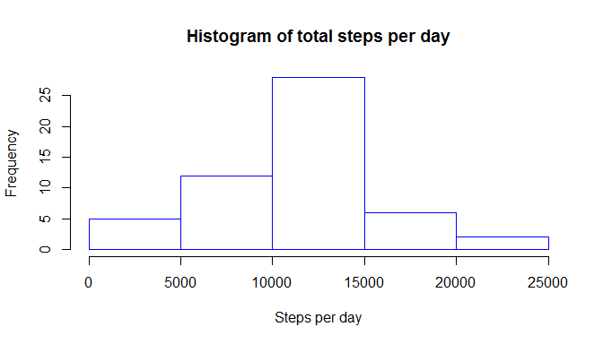
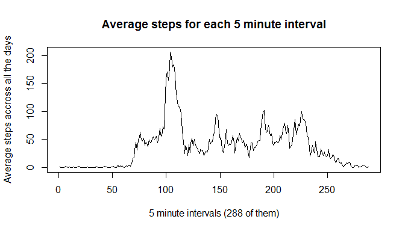
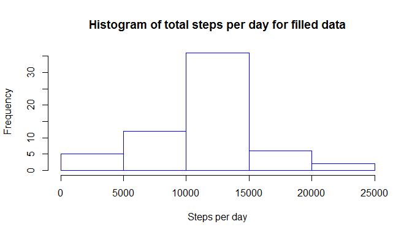
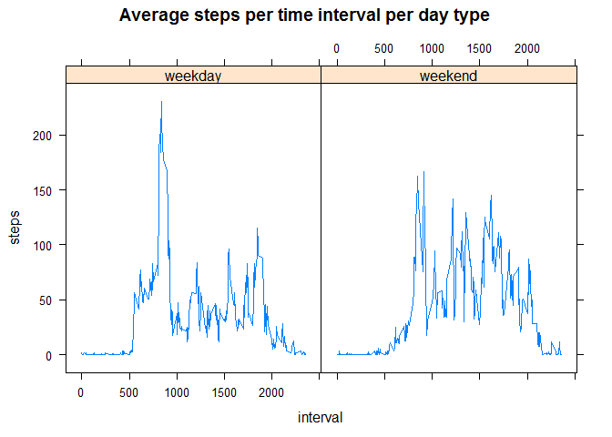

# Reproducible Research: Peer Assessment 1


## Loading and preprocessing the data

```r
#the first time you can unzip like this: unzip("activity.zip")
act<-read.csv("activity.csv",stringsAsFactors = FALSE)
```

## What is mean total number of steps taken per day?
For this part we can ignore the missing values.
### Total number of steps taken per day ###

```r
missingB<-is.na(act$steps)
act_nm<-act[!missingB,]
totalPerDay<-aggregate(act_nm$steps,by = list(act_nm$date),FUN=sum)
```
### Histogram ###

```r
hist(totalPerDay$x, main="Histogram of total steps per day",xlab = "Steps per day",border = "blue")
```

 

### Mean and median of total number of steps taken by date ###


```r
meanSteps <- round(mean(totalPerDay$x),0)
medianSteps <- round(median(totalPerDay$x),0)
```
### The mean of all the total steps per day is 1.0766\times 10^{4}, and the median is 1.0765\times 10^{4}. ###


## What is the average daily activity pattern?

```r
meanPerInterval<-aggregate(act_nm$steps,by = list(act_nm$interval),FUN=mean)
```

```r
plot(meanPerInterval$x,type = "l",
     main="Average steps for each 5 minute interval",
     xlab ="5 minute intervals (288 of them)",
     ylab = "Average steps accross all the days" )
```

 

```r
intervalNumber<-which.max(meanPerInterval$x)
hourMinutes<-meanPerInterval$Group.1[intervalNumber]
hours<-floor(hourMinutes/100)
minutes<-100*(hourMinutes/100 - hours)
```
### The 5 minutes interval with highest average is the interval number 104 corresponding to hour 8, and 35 minutes ###

## Imputing missing values

### Number of missing values is 2304, which is 13.11 percentage of the observations ###

### Filling the missing days with the meanPerInterval ###

```r
fillAct<-act
missAct<-act[missingB,]
require(sqldf)
```

```
## Loading required package: sqldf
## Loading required package: gsubfn
## Loading required package: proto
## Loading required package: RSQLite
## Loading required package: DBI
```

```r
names(meanPerInterval)<-c("interval","steps")
missAct<-sqldf("SELECT meanPerInterval.steps,
               missAct.date,
               missAct.interval
               FROM missAct INNER JOIN meanPerInterval ON    meanPerInterval.interval=missAct.interval")
```

```
## Loading required package: tcltk
```

```r
fillAct[missingB,]<-missAct
```
### Total number of steps taken per day after filling the holes ###

```r
totalPerDay2<-aggregate(fillAct$steps,by = list(fillAct$date),FUN=sum)
```
### Histogram for filled data###

```r
hist(totalPerDay2$x, main="Histogram of total steps per day for filled data",
     xlab = "Steps per day",border = "blue")
```

 
### Mean and median of total number of steps taken by date for filled data###

```r
meanSteps2 <- round(mean(totalPerDay2$x),0)
medianSteps2 <- round(median(totalPerDay2$x),0)
```
### The mean of all the total steps per day is 1.0766\times 10^{4}, and the median is 1.0766\times 10^{4}. ###

The missing values only changed the median a bit, nothing relevant.

## Are there differences in activity patterns between weekdays and weekends?

```r
require(lubridate)
```

```
## Loading required package: lubridate
```

```r
dates<-ymd(fillAct$date)
wd<-wday(dates,label=FALSE)
WD<-matrix(1,length(wd),1)
WD[wd==1 | wd ==7]=2
WD<-factor(WD,labels=c("weekday","weekend"))
fillAct<-cbind(fillAct,WD)

meanPerIntWD<-aggregate(fillAct$steps,
                        by=list(fillAct$interval,fillAct$WD),
                        FUN = mean)
names(meanPerIntWD)<-c("interval","WD","steps")
```
### We can see that during the weekdays the activity peaks on the early morning more than on the weekends. But as the subject starts working during any weekday the activity then is less than on the weekends. It seems he/she probably works (at least part of the time) seated. This person probably excercises in the morning, some cardio. ###


```r
require(lattice)
```

```
## Loading required package: lattice
```

```r
xyplot(steps~interval | WD, 
       data = meanPerIntWD,
       type = "l",
       main="Average steps per time interval per day type")
```

 

